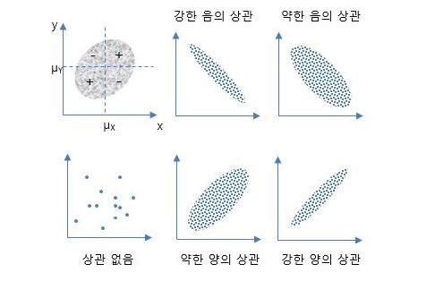

# 0609 통계 관련 내용 정리


## 변수

1. 변수 선택 특징 : 변수 선택은 사용자가 해석하기 쉽게 모델을 단순화해주고, 훈련시간 축소, **차원의 저주 방지**, 과적합을 줄여 일반화를 해주는 장점이 있다.

   ```
   차원의 저주: 데이터의 차원이 증가할수록 해당 공간의 크기가 기하급수적으로 증가하기 때문에 동일한 개수의 데이터의 밀도는 차원이 증가할수록 급속도로 희박해진다. 따라서 차원이 증가할수록 데이터의 분포 분삭 또는 모델추정에 필요한 샘플 데이터의 개수가 기하급수적으로 증가하게 되는 현상을 말한다.
   ```

   

   ```
   과적합(over-fitting): 제한된 학습 데이터 세트에 너무 과하게 특화되어 새로운 데이터에 대한 오차가 매우 커지는 현상이다.
   ```

   

2. 상관계수 (Correlation Coefficient): 두 변수 사이의 통계적 관계를 표현하기 위해 특정한 상관관계의 정도를 수치적으로 나타낸 계수


## 차원축소 (Dimensionality Reduction)

- 차원 축소는 분석 대상이 되는 여러 변수의 정보를 최대한 유지하면서 데이터 세트 변수의 개수를 줄이는 탐색적 분석 기법이다. 
- 원래의 데이터를 최대한 효과적으로 축약하기 위해 목표변수(y)는 사용하지 않고 특성 변수(설명 변수)만 사용하기 때문에 비지도 학습 머신러닝 기법이다.

+ 차원 축소 기법에는 주성분 분석, 특이값 분해, 요인분석, 독립성분분석, 다차원 척도법이 있다.
  + 주성분 분석 (PCA; Principal Component Analysis ) 
    1. 변수들의 공분산 행렬이나 상관행렬을 이용
    2. 원래 데이터 특징을 잘 설명해주는 성분을 추출하기 위해 고차원 공간의 표본들을 선형 연관성이 없는 저차원 공간으로 변환하는 기법
    3. 행의 수와 열의 수가 같은 정방행렬에서만 사용


## 불균형 데이터 처리

- 탐색하는 타깃 데이터의 수가 매우 극소수인 경우에 불균형 데이터 처리를 한다.

- 불균형 데이터 처리 기법으로는 언더 샘플링, 오버 샘플링, 임곗값 이동, 앙상블이 있다.

  

  

  > 건물에서 화재가 발생할 확률은 1% 이하이다. 이와 같이 불균형 데이터에서는 정확도(Accuracy)가 높아도 재현율(Recall)은 급격히 작아지는 현상이 발생한다. 100개의 데이터 중 1개가 화재이면 모두 정상으로 예측해 정확도가 99%이다.

  

### 오버 샘플링

- 오버 샘플링은 소수 클래스의 데이터를 복제 또는 생성하여 데이터의 비율을 맞추는 방법으로 과대 샘플링이라고 한다.
- 정보가 손실되지 않는다는 장점이 있으나 과적합 (Over-fitting)을 초래할 수 있다.
- 알고리즘의 성능은 높으나 검증의 성능은 나빠질 수 있다.


## 데이터 탐색 

### 1. 탐색적 데이터 분석 

( Exploratory Data Analysis : EDA)의 4가지 주제(특징)

| 주제                                      | 내용                                                         |
| ----------------------------------------- | ------------------------------------------------------------ |
| **저항성 (Resistance)**                   | - 저항성은 수집된 자료에 오류점, 이상값이 있을 때에도 영향을 적게 받는 성질 <br />- 저항성이 있는 통계 또는 통계적 방법은 데이터의 부분적 변동에 민감하게 반응하지 않음 <br />- 탐색적 데이터 분석은 저항성이 큰 통계적 데이터를 이용  <br />ex) 탐색적 데이터 분석에서는 평균보다 저항성이 큰 중위수(Median)을 대푯값으로 선호 |
| **잔차 해석 (Residual)**                  | - 잔차란 관찰 값들이 주 경향으로부터 얼마나 벗어난 정도<br />- 잔차를 구해봄으로써 데이터의 보통과 다른 특징을 탐색<br />- 주 경향에서 벗어난 값이 왜 존재하는지에 대해 탐색하는 작업 |
| **자료 재표현 <br />(Re-expression)**     | - 자료의 재표현은 데이터 분석과 해석을 단순화할 수 있도록 원래 변수를 적당한 척도(로그 변환, 제곱근 변환, 역수 변환 등)로 바꾸는 것<br />-자료의 재표현을 통하여 분포의 대칭성, 분포의 선형성, 분산의 안정성 등 데이터 구조 파악과 해석에 도움을 얻는 경우가 많음 |
| **현시성 <br />(Graphic Representation)** | - Display, Visulization, 데이터 시각화로도 불림<br />-현시성이란 데이터 분석 결과를 쉽게 이해할 수 있도록 시각적으로 표현하고 전달하는 과정을 의미<br />-자료 안에 숨어 있는 정보를 시각적으로 나타내줌으로써 자료의 구조를 효율적으로 파악이 가능 |


## 상관관계 분석

### 1. 상관관계 분석 

(Correlation Analysis)의 개념

- 상관관계 분석이란 두개 이상의 변수 사이에 존재하는 상호 연과성의 존재 여부와 연관성의 강도를 측정하여 분석하는 방법 
- 예를 들면, A 기업에서 광고비 지출이 매출액의 증가에 어느 정도 영향이 있는지를 파악할 때 사용하는 방법이다.

### 2. 변수 사이의 상관관계의 종류

| 종류             | 설명                                                         |
| ---------------- | ------------------------------------------------------------ |
| 양(+)의 상관관계 | -한 변수의 값이 증가할 때 다른 변수의 값도 증가하는 경향을 보이는 상관 관계<br />-강도에 따라 강한 양의 상관관계, 약한 양의 상관관계가 있음 |
| 음(-)의 상관관계 | -한 변수의 값이 증가할 때 다른 변수의 값은 반대로 감소하는 경향을 보이는 상관관계<br />-강도에 따라 강한 음의 상관관계, 약한 음의 상관관계가 있음 |
| 상관관계 없음    | -한 변수의 값의 변화에 무관하게 다른 변수의 값이 변하는 상관관계 |


### 3. 상관관계의 표현 방법


 	1. **산점도 (Scatter Plot)을 통한 표현 방법**
 	 - 산점도는 직교 좌표계를 이용해 두 개 변수 간의 관계를 나타내는 방법이다.




2. **공분산을 통한 표현 방법**

   1. 공분산(Covariance)의 개념 : 공분산은 2개 변수 사이의 상관 정도를 나타내는 값
      두 변량(확률변수) 간에 상관성/의존성/유사성의 `방향` 및 `정도`에 대한 척도

         - 두 변량(Variate) 간에 상관관계(Correlation)의 측도(Measure)

   2. 공분산 해석

      | 공분산 값 | 내용                                                         |
      | --------- | ------------------------------------------------------------ |
      | (Cov > 0) | 2개의 변수 중 하나의 값이 상승하는 경향을 보일 때, 다른 값도 상승하는 경향을 보인다면 공분산의 값은 양수가 됨 |
      | (Cov < 0) | 2개의 변수 중 하나의 값이 상승하는 경향을 보일 때, 다른 값도 하강하는 경향을 보인다면 공분산의 값은 음수가 됨 |

      

   3. **공분산의 표현식**

   - 두 변량이 상관적으로 변화되는 척도
   - 두 변량이 각각의 평균으로부터 변화하는 방향 및 크기를 결합시킨 기대값

   

   

   

   

   - 보통 Cov(X,Y),σXY로 표시함    

   

   

   

   

   4. **공분산의 특징**

   - 상관관계의 상승 혹은 하강하는 경향을 이해할 수 있다.

   - 공분산 값의 크기는 측정 단위에 따라 달라지므로 선형관계의 강도를 나타내지는 못한다.
   -  단위가 무차원(dimensionless)
   - 이같은 통계적 상관계수를, 제안자 이름을 따서,  `피어슨의 적률 상관계수` 또는 `피어슨 상관 계수` 라고도 함

   

   

   

   5. **상관 계수 (Correlation Coefficient) = 정규화된 공분산**

   - 두 변수 사이의 통계적 관계를 표현하기 위해 특정한 상관관계를 표현하기 위해 특정한 상관관계의 정도를 수치적으로 나타낸 계수

   - 두 변수 사이의 연관성을 수치적으로 객관화하여 두 변수 사이의 방향성과 강도를 표현하는 방법
   - 상관계수(r)의 범위 :   -1 ≤ ρ ≤ 1( 상관계수가 절댓값 1에 가까울수록 강한 상관관계)
   - 공분산이 각 변량의 단위에 의존하게되어 변동 크기량이 모호하므로, 공분산에다가 각 변량의 표준편차를 나누어주어 `정규화`시킴

```
  ㅇ 양의 상관 : `강한 양의 상관관계`  (positively correlated)
     - 두 변량이 같은 방향으로 움직임 (X가 커지면 Y도 덩달아 커짐)
        . 만일, 두 변량이 크기도 같고, 같은 방향이면, ρ = 1 이 됨

  ㅇ 영의 상관 : `상관관계 없음`       (uncorrelated)
     - 두 변량이 상호 독립 (상관관계가 전혀 없음)
        . 만일, 두 변량이 상관 없으면, ρ = 0 이 됨
           .. 즉, 통계적 독립인 경우

  ㅇ 음의 상관 : `강한 음의 상관관계`  (negatively correlated)
     - 두 변량이 반대방향으로 움직이는 것 (X가 커지면 Y는 작아짐)
        . 만일, 두 변량이 크기는 같으나, 다른 방향이면, ρ = -1 이 됨
```

