# 0616_visualization (시각화)

------------

💡0616 데이터 시각화가 우리에게 이해와 데이터 해석 능력을 높여준다.  데이터를 표현하고 **결측 값(missing value)을 확인**하고, **특이치(outlier)를 식별하고 이상 징후를 탐지하는**등 만족스러운 결과를 가져올 수 있다.

----------


## LEFT JOIN & PANDAS

오늘은 LEFT JOIN으로 원하는 컬럼을 판다스 데이터 프레임에 붙이는 연습을 할 예정

###CRISP-DP (Cross Industry Standard Process for Data Mining)

내가 쓰는 방법론에 대한 설명을 보고서에 제시를 하고, 방법론의 단계에 맞춰 분석을 진행했다는 것을 넣는다.

---------------

## Seaborn 

[seaborn](https://seaborn.pydata.org/tutorial/function_overview.html) 

**matplot으로 읽고 seaborn으로 데코레이션 할 수 있다.**

https://seaborn.pydata.org/tutorial.html


### 1. scatterplot

- hue : 두가지 변수를 입력받아 점이 2차원 배열로 나타내어질 때 다른 변수에 따라 변수를 색칠하면서 한가지 차원을 추가할 수 있다.
- 만약 구분되는 값이 범주형이 아니라 실수형이라면 연속되는 색깔들(sequential palette)로 표현한다.

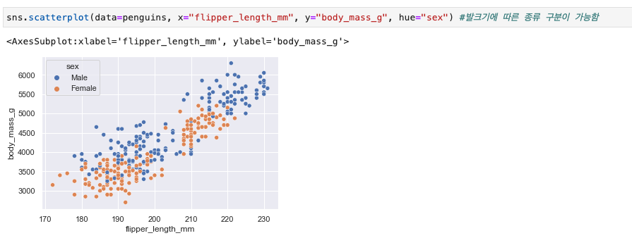

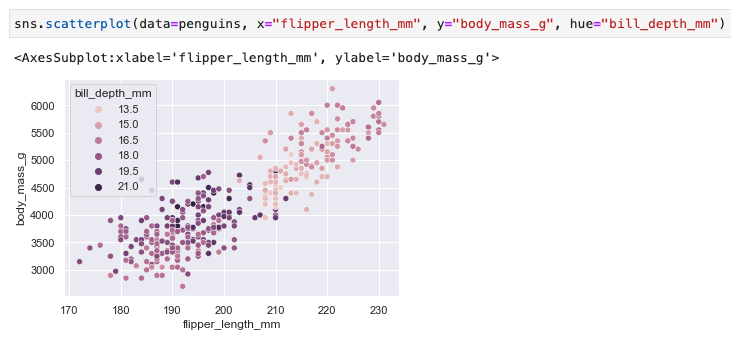


### 2. histplot

- 
  변수에 대한 히스토그램을 표시한다.

- 직관적으로 분포를 볼 수 있다.

- 하나 혹은 두개의 변수 분포를 나타내는 전형적인 시각화 도구로 범위에 포함하는 관측수를 세어 표시한다

- hue: 각 카테고리를  비교가능하다. 하나의 독립변수를 정의해놓고 그 안에서 라벨(카테고리)의 분포를 알 수 있다.

  

  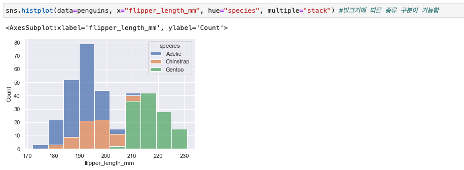

  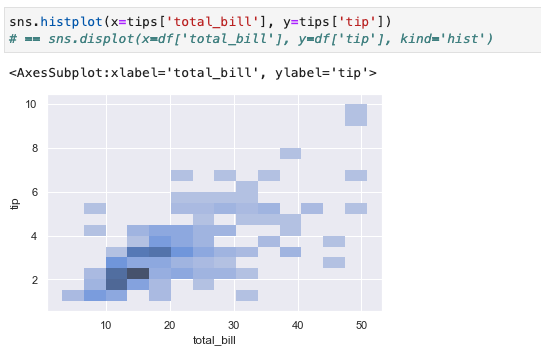

  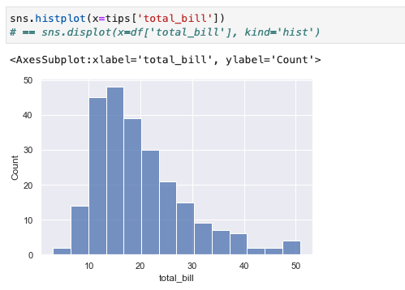


### 3. kdeplot

- 하나 혹은 두개의 변수에 대한 분표를 그린다.

- histplot이 절대량이라면 kdeplot은 밀도 추정치를 시각화한다.

- 그래서 결과물로는 연속된 곡선의 그래프를 얻을 수 있다. (히스토그램을 연속된 값으로 보여주는 형태)

  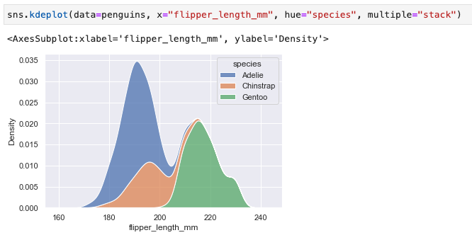


### 4. displot(displayplot)


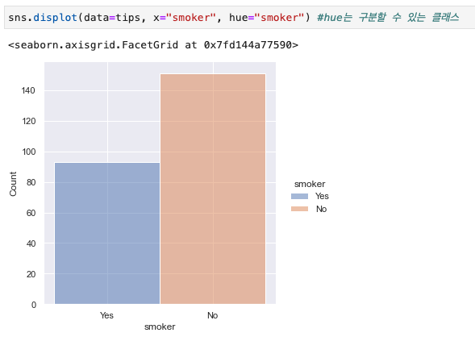

```python
sns.displot(data=penguins, x="flipper_length_mm", hue="species", multiple="stack") 
sns.displot(data=penguins, x="flipper_length_mm", hue="species", col="species")

# 차이는 multiple, col 중에 무엇을 쓰느냐에 따라 그래프 형태가 달라짐 

```

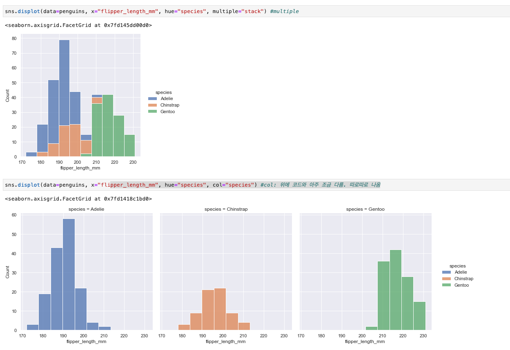


### 5. regplot

- 데이터의 상관성을 볼 수 있는 **regplot**

- Regression plot은 지금까지 봐온 plot과는 개념이 조금 다른데, regression 머신러닝의 결과를 그래프에 표기해준다.

  즉 데이터를 있는 그대로 보여주기보다는, 머신러닝 결과와 함께 보여주는 것이다.

  

  

  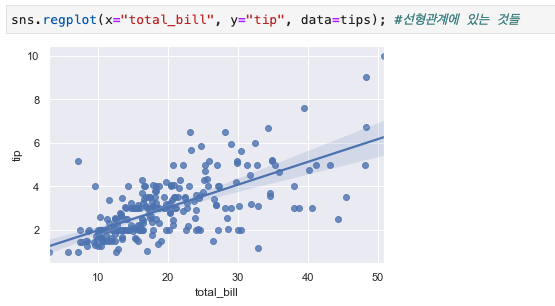

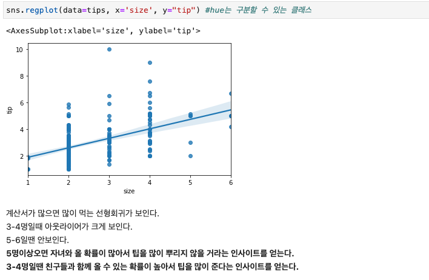


### 6. lmpot

- lmplot도 직관적으로 전반적인 데이터를 살펴보기에 아주 중요하고, distplot과 마찬가지로 아웃라이어들을 제거해주는 작업이 역시나 중요한 툴이다. 
  distplot에 히스토그램이 디폴트로 등장하는 것처럼 lmport에는 회귀선이 디폴트로 등장하는데 fit_reg=False 라고 코드를 입력하여 제거해줄 수 있다. 

- 분석하고자 하는 2개의 feature 컬럼을 x축과 y축으로 설정하고 그에 따라 비교하고자 하는 결과값을 hue에 설정하면 정확히 그 위치에 해당하게 점들이 찍힌다. 

- hue에 들어간 컬럼의 값을 구분하여 따로따로 모델링하여 결과를 보여준다.

- 


  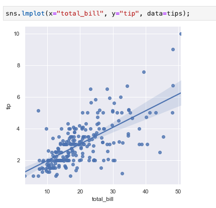

  

  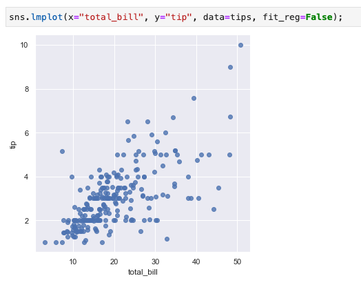


  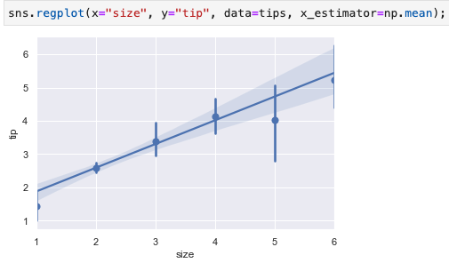

  


### 7. distplot

- 선그래프로 변화 추이를 나타내기 위한 시각화 툴이다.
  <u>**distplot 코드를 짤 때 주의해야 할 점은 먼저 column을 뽑아내는 작업을 해야한다는 점이다 .</u>**
  이후 column을 감싸듯이 distplot을 불러와 적용한다.

- distplot을 불러오면 막대그래프와 선그래프가 동시에 등장한다.
  하지만 distplot을 사용함에 있어 막대그래프(히스토그램)가 필요한 경우는 거의 없다. 따라서 코드에 추가적으로 **hist=False** 값을 입력하여 선그래프만 나타날 수 있도록 설정할 수 있다. 만약 히스토그램만 나타내고 싶으면 **kde=False**를 입력한다.

- 또한 데이터 분석을 하다보면 대부분의 값들과 동 떨어진 예외적인 값들이 꼭 하나씩 등장하기 마련인데, 이러한 값들을 **"아웃라이어"**라고 부른다. 
  특히 distplot은 직관적으로 분석하기 좋은 툴이라 다른 시각화들에 비해 아웃라이어들을 제거해주는 작업이 특히 중요하다.

- distplot은 '가우시안 분포', 즉 정규분포(가운데가 쏠린 종모양) 모양이 나올 때가 가장 이상적이라고 보면 된다.
  가능한 가우시안 분포가 나오도록 하고, 다른 곳들에 중간에 봉우리처럼 툭 튀어나온 부분들이 있으면 그 부분에 집중하여 분석해보면 된다.

- 예를 들면 이 자료에서는 운임요금에 대해서 distplot을 나타낸 것이므로, 운임요금을 특별히 많이 내는 계층이 있는지에 대해서 직관적으로 '작은 봉우리'들로 합리적 의심을 해볼 수 있다.

  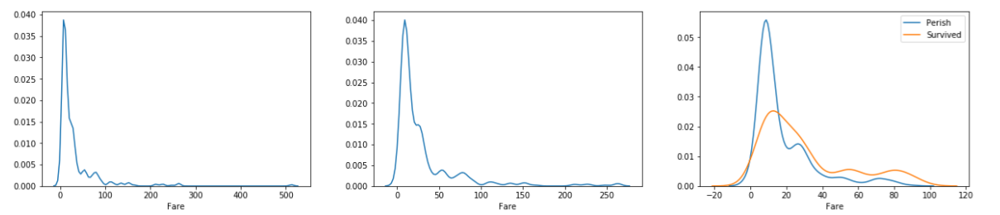

  


  ```python
  import seaborn as sns
  import pandas as pd
  import numpy as np
  import seaborn as sns
  import matplotlib.pyplot as plt
  
  sns.set_theme(color_codes=True)
  
  train=sns.load_dataset('titanic')
  
  train.head()
  
  sns.distplot(train["fare"],hist=False)
  
  low_fare = train[train['fare'] < 100]
  print(low_fare.shape)
  low_fare.head(3)
  
  perish=low_fare[low_fare['survived'] == 0]
  survived =low_fare[low_fare['survived']==1]
  
  sns.distplot(perish['fare'],hist=False, label="Perish")
  sns.distplot(survived['fare'],hist=False, label="Survived")
  
  
  ```

  > 밀집도 그래프 - 주어진 데이터를 정규화시켜 넓이가 1이 되도록 그린 그래프 
  >
  > 변수 = plt.subplots() 
  >
  > 변수 = sns.distplot( 데이타프레임명[컬럼명] )
  >
  > - 밀집도 그래프 제외, 히스토그램만 표시 
  > 변수 = sns.distplot( 데이타프레임명[컬럼명], kde=False) 
  >
  > - 밀집도 그래프 표시, 히스토그램 제외 
  > 변수 = sns.distplot( 데이타프레임명[컬럼명], hist=False) 
  >
  > 변수.set_title('제목')
  >
  > 

  ```python
  ax = plt.subplots()
  ax = sns.distplot(tips['total_bill'])
  
  # kde=False 히스토그램만 표시 
  # ax = sns.distplot(tips['total_bill'], kde=False)
  
  # hist=False 그래프만 표시 
  # ax = sns.distplot(tips['total_bill'], hist=False)
  
  ax.set_title('Total Bill Histogram')
  ```

  

  reference: [seaborn 시각화 툴1](https://daily-life-of-bsh.tistory.com/94), [seaborn 시각화 툴2](https://brunch.co.kr/@jjason68/12)


### 8. countplot

- 흔히 알고 있는 막대그래프이다. 가장 많이 사용되는 시각화 툴이다. 알고자하는 x축 값에 적으면 효과적인 시각화를 완성 할 수 있다.

  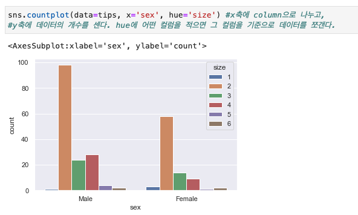

### 9. barplot

- countplot과 모양이 같은 막대그래프와 비슷하지만, 명백히 다른 시각화이며 별개의 유용한 툴이다.
  barplot이 countplot과 구별되는 가장 큰 차이점은 Y축 값의 설정이 가능하다는 것이다. 

  즉 판다스에서 decision Tree를 구성할 때 많이 등장했던 Feature와 Label을 barplot에서는 명백하게 설정할 수 있다는 것이다.

  countplot은 y축을 디폴트로 데이터 개수를 세는 데에 그치기 때문에 분석하려는 데이터 결과값에 숫자값이 들어가지 않는다면 countplot을 사용해도 무방하지만, 분석하려는 label에 소숫점이나 정수가 들어간다하면 Y축에 label의 대상이 되는 Column을 넣고 barplot을 사용해야한다.

  쉽게  생각하면 classification 문제면 countplot, regression 문제면 barplot을 쓴다.

  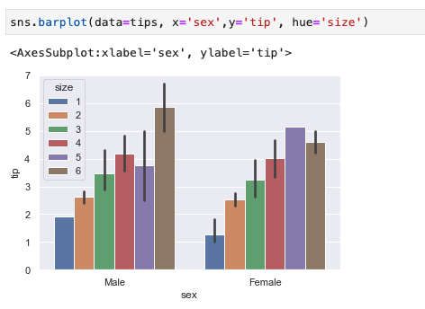

---------

## Matplotlib

피어슨 상관계수 전제조건

**scatterplot**을 쓰기 위함 

1. 정규분포
2. 변수들의 상관성이 선형이어야한다.


----

## Plot

plt.legend(loc='upper right', fontsize=15) => 범례

---------

## pd.crosstab


```
size = pd.crosstab(index=tips['size'], columns='count') 
```

```
size_tip = pd.crosstab(index=tips['size'], columns=tips['tip']) 
```

```
size_t_bill=size_tip = pd.crosstab(index=tips['size'], columns=tips['total_bill']) 
```


-----------

## profile_report()

### correlation

```
tips.pandas_hy.ipynb
```

​	

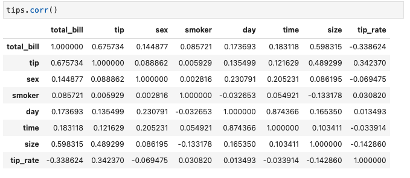

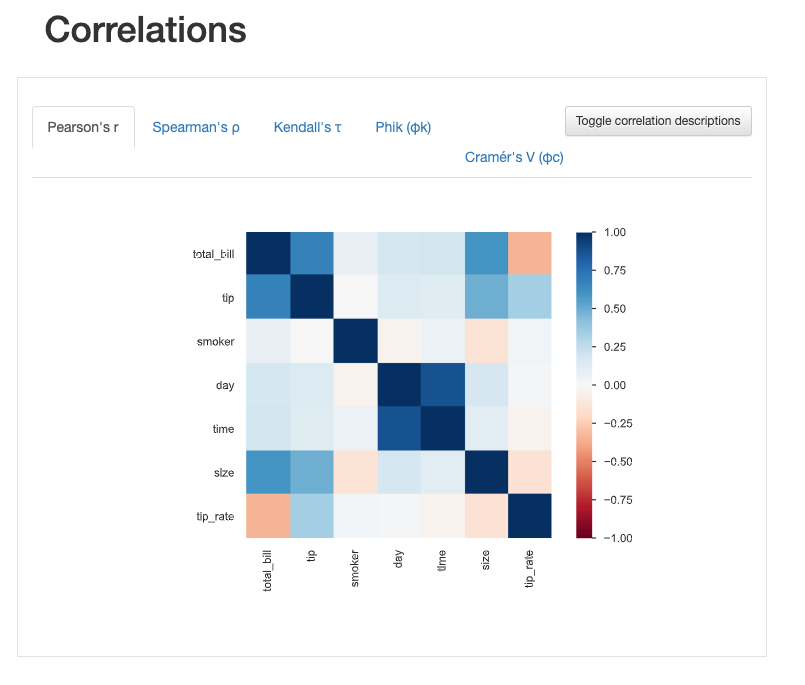


## 분석 내용 ( by 유화영 )

- total_bill을 기준으로 tip, size와 양의 상관관계를 보인다. 즉, total_bill이 높을수록 tip이나 size도 높은 경향을 보인다.  

- 그러나, total_bill과 tip_rate는 음의 상관관계를 보인다. 즉, total_bill이 높을수록 tip_rate는 낮은 경향을 보인다. 

- 상관계수 데이터 프레임을 통해, 레스토랑은 어떤 전략을 취할 것인지 방향성을 구체화할 수있다. 

- size를 기준으로 tip과 양의 상관관계를 보이는데, size가 2명일 때 tip을 많이 지불하는 경향이 있다.  

- day를 기준으로 time과 높은 양의 상관관계가 보이는데, 토요일과 일요일에는 Dinner에  몰리는 경향이 있다.  그리고 목요일에는 Lunch에 손님이 몰리는 경향을 보인다.  

- 토요일과 일요일 저녁에는 2명 전용 세트메뉴(15$<= total_bill <= 20$)와 2명 전용 테이블을 구성하여, 2명이 식사를 하러 오기 좋은 레스토랑의 환경을 만들어 손님을 유도하는 전략을 취하면 종합적으로 팁을 더 많이 받을 수 있을 것이라 예상된다. 또한 회전율도 높일 수 있을 것 같다. 

- 남성이 여성보다 팁을 주는 비율이 높다.


  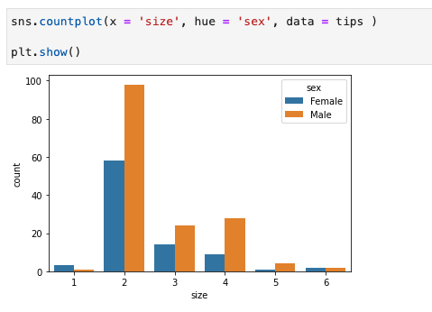

  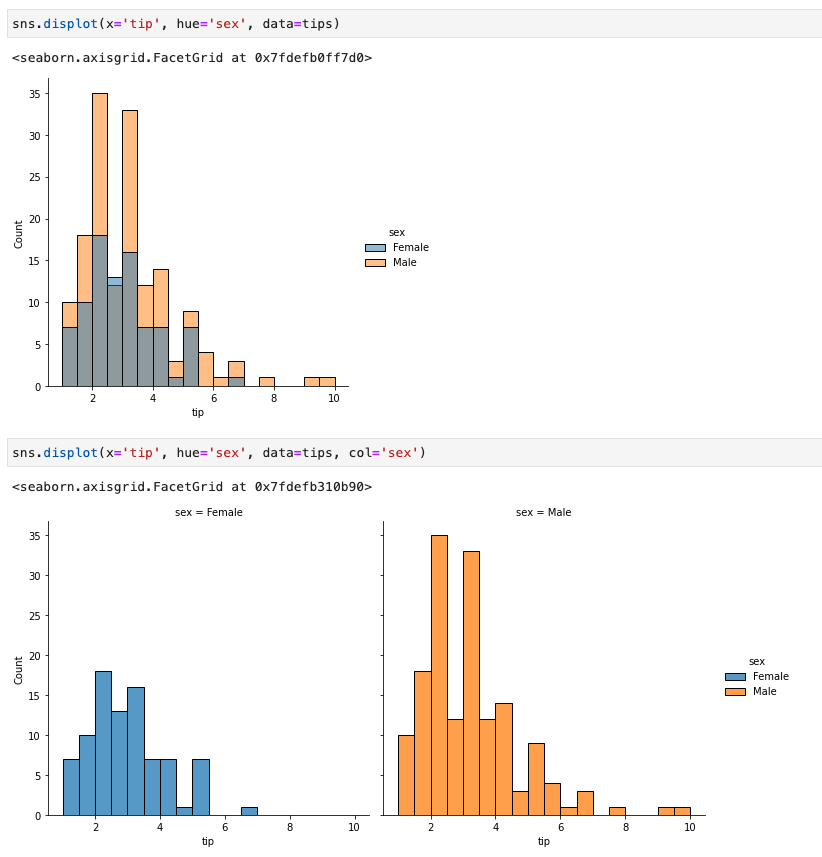

  

- 주말 저녁에는 남성의 비율이 월등히 더 높고, 목요일 저녁은 남성의 비율과 여성의 비율이 비슷하다. 주말 저녁에는 남성전용 메뉴나 서비스를 구성하는 프로모션이 있으면 좋을 것 같다. 
  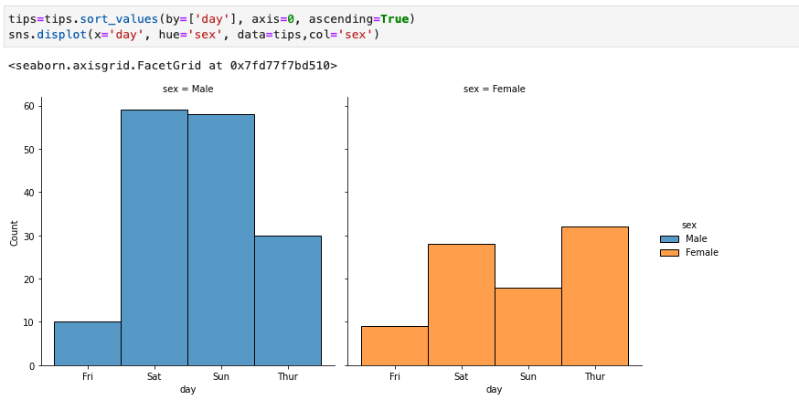


- 주말에는 dinner 회전율을 더 높이기 위해 날씨가 좋은 날에는 야외 테이블을 만들어 손님을 더 받거나, 손님이 머무르는 시간을 줄일 수 있도록 메뉴 예약과 같은 전략을 취하면, 서비스의 속도가 빨라지므로 결과적으로 회전율이 높아질 수 있는 방안이 될 수 있다.


---------------

### 목표변수

1. 매출
2. tip
3. 요일별 팀 size 수
4. tip rate
5. 요일별 방문 예상팀 수 (식사재 준비를 위해)!

- total bill이 목표변수가 되면 inputparameter가 된다
- tip이 목표변수가 된다고 하면 inputparameter가 된다.
- size가 목표변수(target)가 된다고 하면 inputparameter가 된다. =목표변수, target_valuable, 

**목표변수가 4개면 모델이 4개 나온다.**
전제가 uni valuable이면 일반적으로 목표변수가 4개면 모델도 4개 나온다.

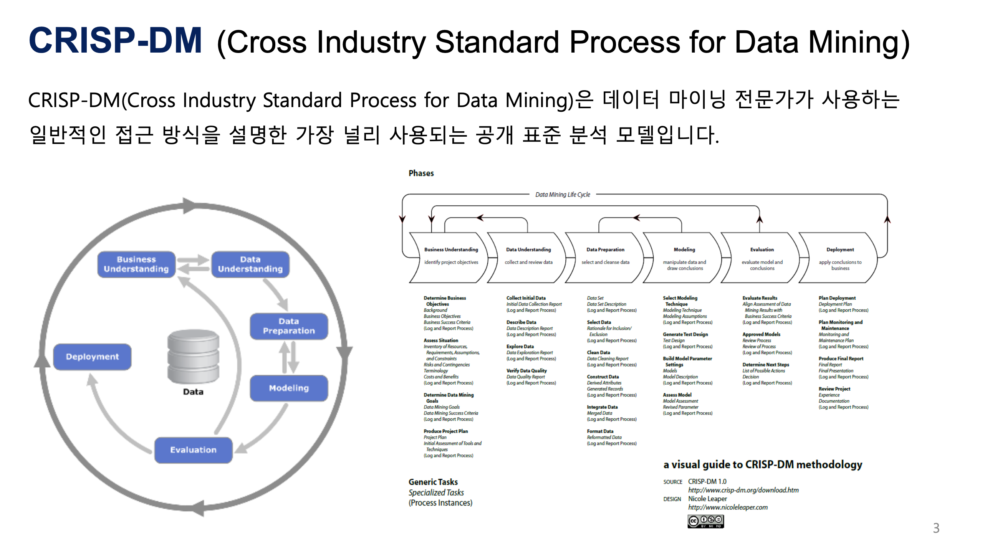


**유튜버가 채널을 운영하는 목표변수는 구독자들이 오래 머물게 하는 것이다.**
**오래 머물게 하려면 주변에 끊임없이 관심 주제에 대한 추천을 해주는 것이다.** 
**이것이 유튜브 컨텐츠의 추천 모델의 목표변수이다.** 


예측 분석 응용: 부동산 담보대출 채권 가치 추산

1. 무엇을 예측하는가? 부동산 담보대출 고객 중에서 누가 향후 90일 내에 조기 상환할 것인가
2. 무엇을 할 것인가? 부동산 담보대출 채권의 가치를 계싼한 후 다른 은행에 팔아 넘길지 여부를 결정한다. 

