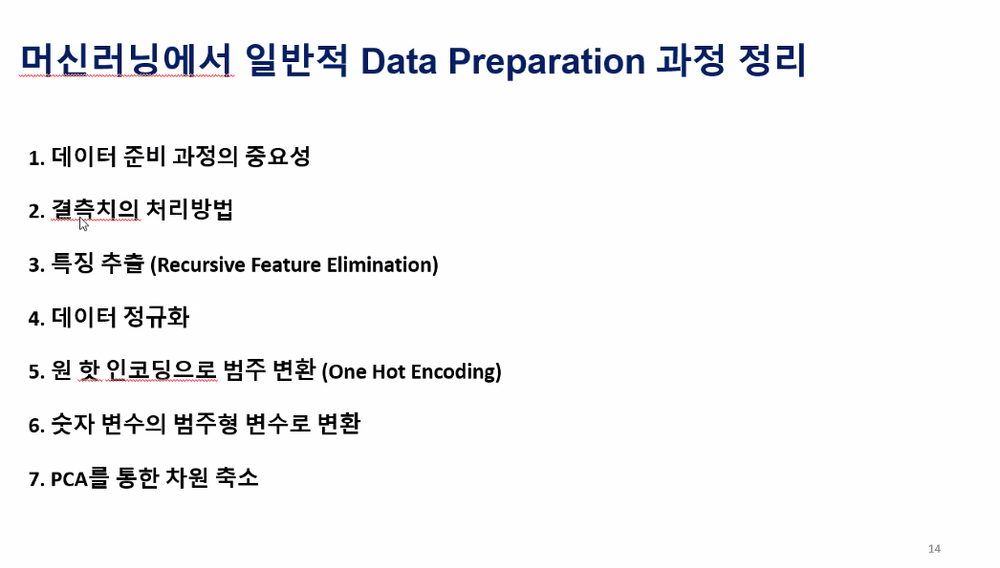
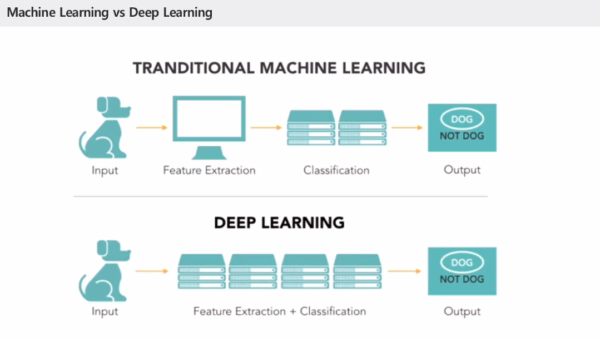
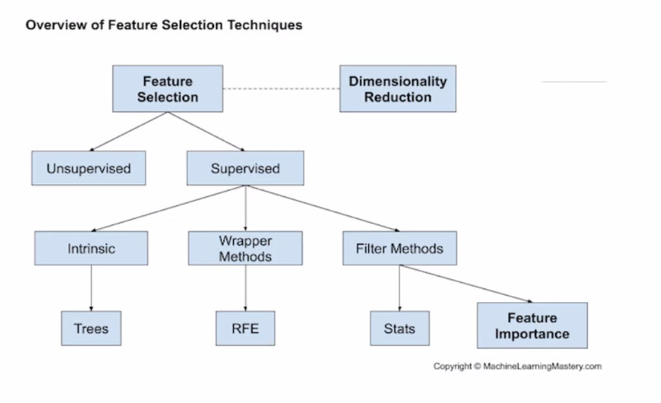
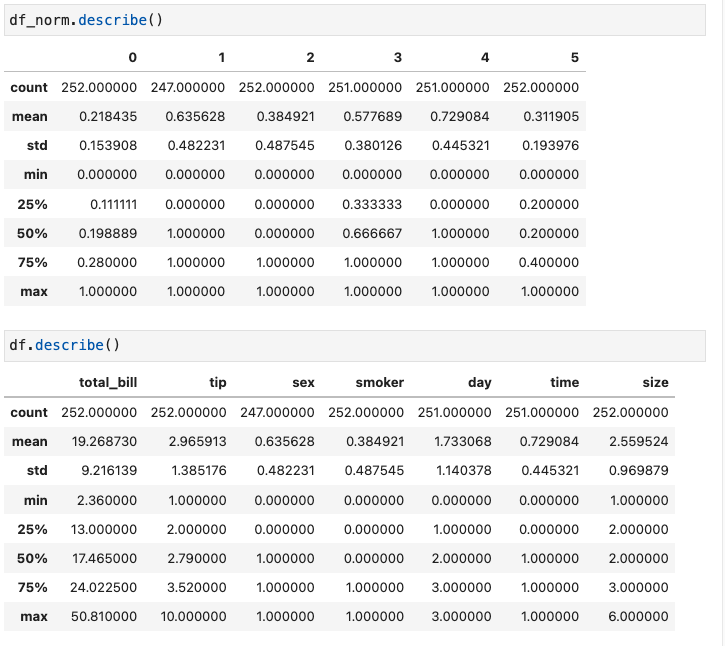
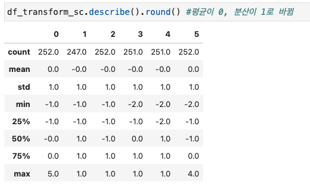
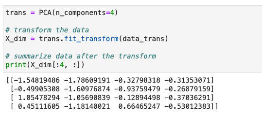
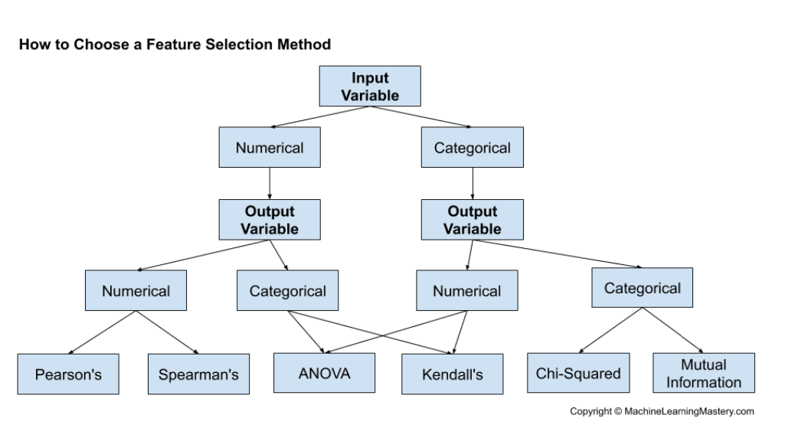
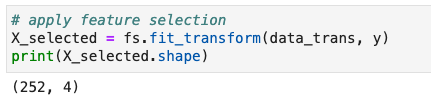
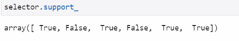

# 📖 0617

-------------


## 머신러닝에서 일반적 Data Preparation 과정 정리



1. 데이터 준비 과정의 중요성
2. 결측치의 처리방법
3. 특징 추출 
4. 데이터 정규화
5. 원 핫 인코딩으로 범주 변환
6. 숫자 변수의 범주형 변수로 변환
7. PC를 통한 차원 축소

***The goal of a model is to privde a simple low-dimensional summary of dataset - Hadley Wickham***

------------------

## **목표변수**

1. **매출**
2. **팁**
3. **요일별 팀 Size 팀수**
4. **tip rate**
5. **요일별 방문 예상팀 수 (식자재 준비를 위해)!**

우리는 featurer selectionotal bill이 목표라고 하면 독립변수가 7개가 되는데 7의 변수들의 상관관계를 볼거고
인과관계를 볼 예정이다. 

두 독립변수의 관계는 평균값과 분산값으로 나타낼 수 있는데, 공분산을 통해서 이들의 상관관계를 알 수 있다.


-----------





-------------

## SQL 실행

```sql
use tip;

SELECT * FROM tips;


INSERT INTO tips (total_bill, tip, sex, smoker, day, time, size)
VALUES (3.07, 1, 'Female', 'Yes', 'Sat', 'Dinner', 1);

INSERT INTO tips (total_bill, tip, sex, smoker, day, time, size)
VALUES (3.07, 1, 'Female', 'Yes', 'Sat', 'Dinner', 1);

select * from tips where tips.sex='null';
insert into tips (total_bill, tip, sex, smoker, day, time, size)
values (4.36, 2.61, 'null', 'No', 'Sat','Dinner', '4');

select * from tips where tips.sex='null';

DELETE from tips WHERE tips.sex = 'null';

SELECT * FROM tips; 

insert into tips (total_bill, tip, sex, smoker, day, time, size)
values (4.36, 2.61, 'null', 'No', 'Sat','Dinner', '4');

insert into tips (total_bill, tip, sex, smoker, day, time, size)
values (2.36, 3.00, 'null', 'No', 'Sat','Dinner', '2');

SELECT * FROm tips where tips.day='' ;
```


-------

python query.py => 실행예정

---

## pandas 실행

``` python
import pymysql.cursors

Connect to the database

import pandas as pd
```

```python
# MySQL DB에서 데이터 받아와서 DataFrame에 저장

conn = pymysql.connect(host='localhost',
        user='yoohwayoung',
        password='jslee818++',
        db='tip',
        charset='utf8',
        autocommit=True, cursorclass=pymysql.cursors.DictCursor)
try:

   with conn.cursor() as curs:
      sql = "SELECT * FROM tips; "
      curs.execute(sql)
      rs = curs.fetchall()

      # DB에서 받아온 값을 DataFrame에 넣음

      df = pd.DataFrame(rs)
      print(df)
   df.to_csv('query.csv')
    

    
finally:

   conn.close()
```


```python
df['sex'].replace({'Female':0, 'Male':1}, inplace=True)#바이너리인코딩
df['smoker'].replace({'No':0, 'Yes':1}, inplace=True)#바이너리인코딩
df['time'].replace({'Lunch':0, 'Dinner':1}, inplace=True)#바이너리인코딩
df['day'].replace({'Thur':0, 'Fri':1, 'Sat':2, 'Sun':3}, inplace=True) #라벨인코딩
```

```
df.isnull().sum()
```

```
```

---------------

## 결측치 제거 / 대체


----------------

## 차원 축소



🖇PCA.pdf


### RFE vs PCA

rfe는 독립변수들과 목표변수와의 관계를 통해 차원을 축소시킨다.
pca 는 독립변수들끼리의 상관관계만으로만 차원을 축소시킨다.

```python
# rfe : 목표변수와 인풋파라메터가 짝을 이뤘을때

# define RFE
rfe = RFE(estimator=DecisionTreeClassifier(), n_features_to_select=5)

# fit RFE
rfe.fit(X, y) #fit할때 y값을 넣고
```

```python
# PCA : 목표변수 없이 두 변수의 상관계수로 본다.
# y값(목표변수 없이)

# define dataset
X, y = make_classification(n_samples=1000, n_features=10, n_informative=3, n_redundant=7,
random_state=1)

# summarize data before the transform
print(X[:3, :]) # y값을 안넣고
```


-------------

## MinMaxScaler

```python
# example of normalizing input data
from sklearn.datasets import make_classification
from sklearn.preprocessing import MinMaxScaler

trans=MinMaxScaler()

data.shape

X_norm=trans.fit_transform(data)

df_norm=pd.DataFrame(X_norm)
df_norm.describe()
```



max 를 비교해보면 범위가 0~1 사이로 변화

-----------

## StandardScaler

<span style = "color:red">평균이 0, 분산이 1로 바뀜

```python
from sklearn.preprocessing import StandardScaler
sc = StandardScaler()
df_sc = sc.fit_transform(data)
df_transform_sc=pd.DataFrame(df_sc)
df_transform_sc.describe().round() #평균이 0, 분산이 1로 바뀜
```




-------------

## PCA

```python
from sklearn.datasets import make_classification
from sklearn.decomposition import PCA

trans = PCA(n_components=4)  # n_components는 무슨 기준으로 지정하는가?

# transform the data
X_dim = trans.fit_transform(data_trans)

# summarize data after the transform
print(X_dim[:4, :])
```




------------

## Regression Feature Selection



```python
from sklearn.datasets import make_regression
from sklearn.feature_selection import SelectKBest
from sklearn.feature_selection import f_regression

fs = SelectKBest(score_func=f_regression, k=4)
# apply feature selection
X_selected = fs.fit_transform(data_trans, y)
print(X_selected.shape)
```




-----------

## 차원축소를 할 때, 버리는 colums는?



rfe에서 선별한 변수는 무엇이고, 
PCA에서 선별한 변수는 무엇인지 어떻게 알 수 있는가?

