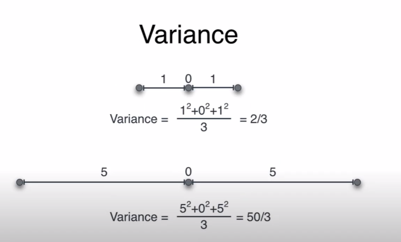
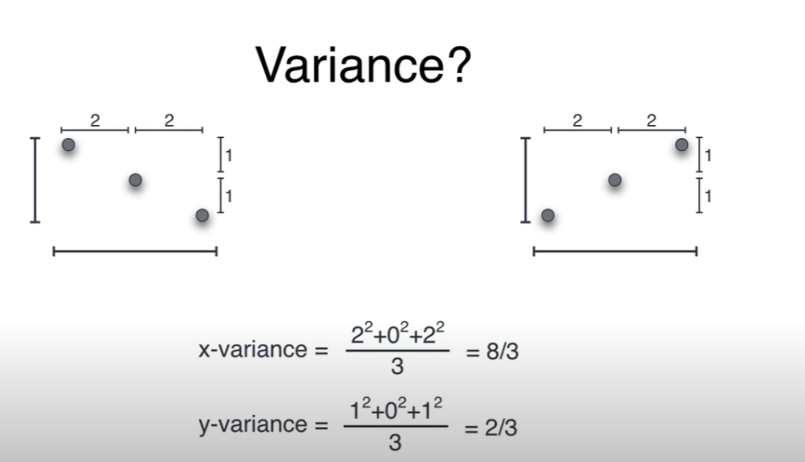
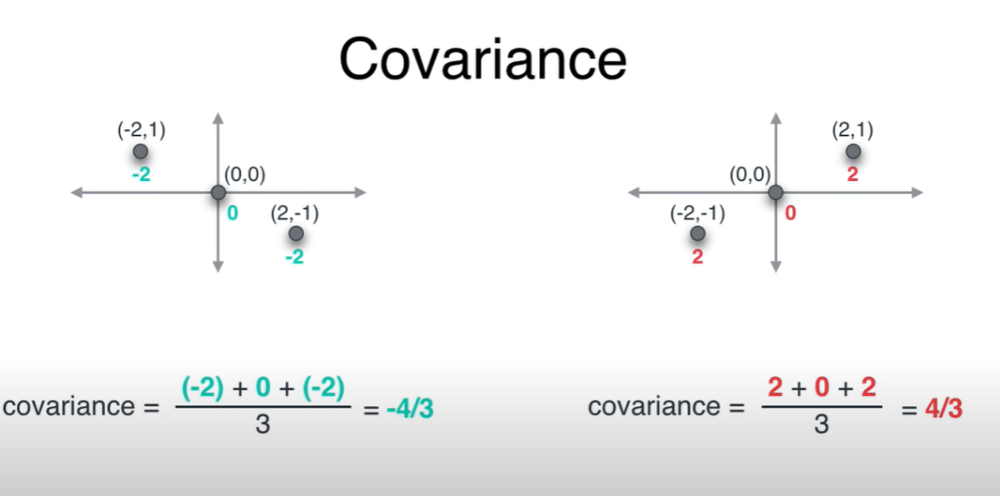
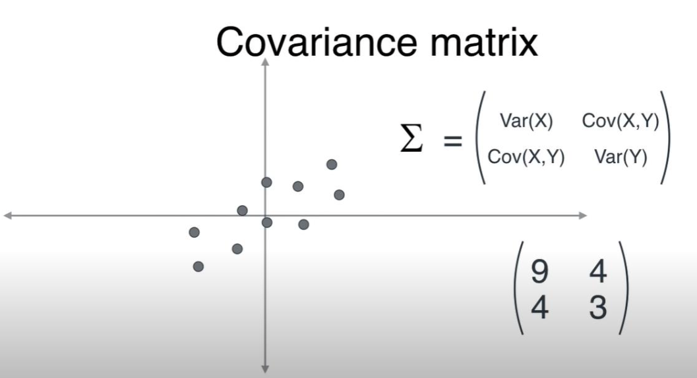
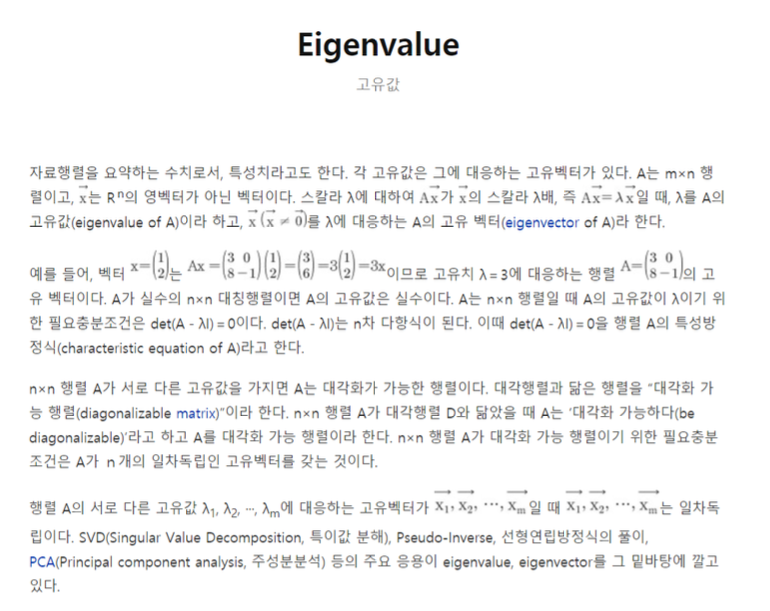
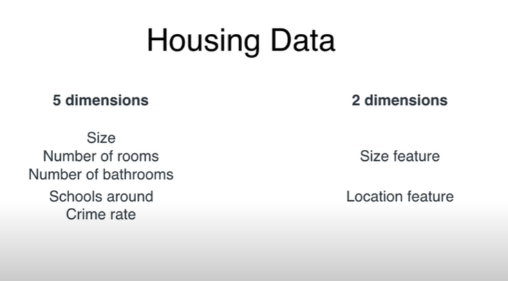
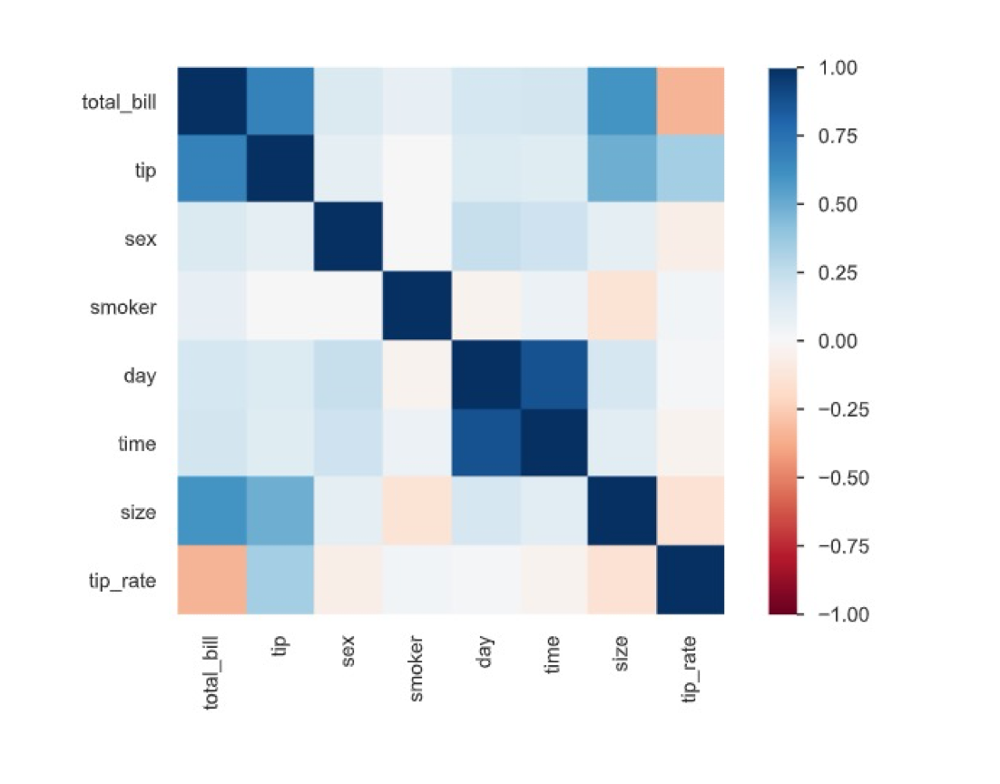

# 📚0618

----------

https://www.3blue1brown.com/\

Luis Serranodkffuwn

---------

## TensorFlow

## PyTorch

----------

## SVM 

> **서포트 벡터 머신**(support vector machine, **SVM**[[1\]](https://ko.wikipedia.org/wiki/서포트_벡터_머신#cite_note-CorinnaCortes-1).[[2\]](https://ko.wikipedia.org/wiki/서포트_벡터_머신#cite_note-2))은 [기계 학습](https://ko.wikipedia.org/wiki/기계_학습)의 분야 중 하나로 패턴 인식, 자료 분석을 위한 [지도 학습](https://ko.wikipedia.org/wiki/지도_학습) 모델이며, 주로 [분류](https://ko.wikipedia.org/wiki/분류)와 [회귀 분석](https://ko.wikipedia.org/wiki/회귀_분석)을 위해 사용한다. 두 카테고리 중 어느 하나에 속한 데이터의 집합이 주어졌을 때, SVM 알고리즘은 주어진 데이터 집합을 바탕으로 하여 새로운 데이터가 어느 카테고리에 속할지 판단하는 비[확률적](https://ko.wikipedia.org/wiki/확률) 이진 [선형 분류](https://ko.wikipedia.org/wiki/선형_분류) 모델을 만든다. 만들어진 분류 모델은 데이터가 사상된 공간에서 경계로 표현되는데 SVM 알고리즘은 그 중 가장 큰 폭을 가진 경계를 찾는 알고리즘이다. SVM은 선형 분류와 더불어 비선형 분류에서도 사용될 수 있다. 비선형 분류를 하기 위해서 주어진 데이터를 고차원 특징 공간으로 사상하는 작업이 필요한데, 이를 효율적으로 하기 위해 [커널 트릭](https://ko.wikipedia.org/w/index.php?title=커널_트릭&action=edit&redlink=1)을 사용하기도 한다.
>
> ref. [SVM](https://ko.wikipedia.org/wiki/%EC%84%9C%ED%8F%AC%ED%8A%B8_%EB%B2%A1%ED%84%B0_%EB%A8%B8%EC%8B%A0)
>
> 

---

## Target 

### Total Bill => PCA with Mutate Variable <u>tips rate</u>

### Target : Total Bill => RFE with Mutate Variable <u>tips rate</u>

### Target : Total Bill => Regression Feature Selection with Mutate Variable <u>tips rate</u>

### Nomalization

### standardization

---------------------

## 차원의 저주란?

---

📎pca.pdf

## Variance

평균은 같지만, 편차가 크다. 
평균이 같다고 해서 A반과 B반의 수준이 똑같다라고 말할 수 없다.

### covariance matrix를 만든다. 

**우리가 PCA를 하는 근본적인 이유는 차원의 축소를 하면서 데이터를 직관적으로 표현하기 위해서이다. 2차원 이상에서의 데이터의 분포를 차원을 줄이면서 가장 잘 보이게 하기 위한 축을 찾는 것이다.**

​		

ref. [PCA_1](https://stackoverflow.com/questions/55582413/put-results-of-pca-into-dataframe)

--------------

## Eigenvalue

- 다중공산성 

- 다중공선성문제(Multicollinearity)는 통계학의 회귀분석에서 독립변수들 간에 강한 상관관계가 나타나는 문제이다. 독립변수들간에 정확한 선형관계가 존재하는 완전공선성의 경우와 독립변수들간에 높은 선형관계가 존재하는 다중공선성으로 구분하기도 한다. 이는 회귀분석의 전제 가정을 위배하는 것이므로 적절한 회귀분석을 위해 해결해야 하는 문제가 된다.

  

  ref. [다중공선성 정리](https://ai-times.tistory.com/268)

