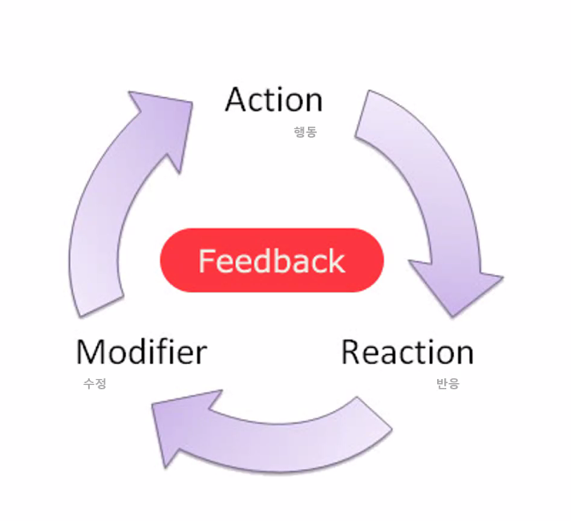

# UI/UX 

디자인 서비스의 기획
----------------

기획에 대한 기본적인 내용 진행
사업에 대한 개요와 프로젝트를 기획하고 제안을 하는 과정

---

## 컨텐츠를 개발한다는 것은?

개인이 하루에 사용하는 앱이 굉장히 많다. 
아이폰이 나오면서 한국의 무선 네트워크가 넓어졌다.
무선 인터넷에 대한 이통3사의 기득권이 사라지고, 수평식/상향식 프로세스로 바뀌기 시작했다.
시장을 어떻게 개편하느냐가 핵심이었다. 
순식간에 스마트폰으로 대부분의 업무를 할 수 있게 바꾸었다.

### 문제 의식을 가지는 것이 기획의 시작

IT개발자, IT기획자가 되는 것이 전부가 아니다.

### 기획

1. 다른 사람에 대한 이해
   - ux를 만들고 무언가 기획한다는 것의 시작은 다른 사람에 대해 이해하는 것이다.
   - 개발을 하고 기획을 하는 이유는 다른 사람을 위해서 만드는 것이다. 
   - 당연히 다른 사람을 이해해야한다.
2. 문화 만들기
   - ex. 코로나 시국에 가상환경으로 축제 즐기기
   - 제페토를 만들고 가상공간을 사용하는 문화가 만들어졌다. IT 개발자, IT 기획자는 그 가상의 공간을 채우는 콘텐츠를 기획할 수 있어야한다.
3. 기술을 통한 행복한 삶 만들기

------------------

## 앱 개발을 위한 기획과 실행

### 의도-기획-실행

기본적을 어떤 것을 만들건지에 대해 기획 = 비즈니스 모델을 1가지 기획

오늘 진행 : 앱컨셉 기획 - 와이어프레임작성 - 프로토타입 제작 - GUI디자인

### **PROCESS**

1. 문제찾고 조사하기
2. 생각을 구체화하기
3. 해결방안 찾기
4. 시각화하기

**SNS 소개하기**

-----------------

## UX-UI의 이해

1. UX란? 사용자 경험이라는 총체적인 관점으로 컨셉을 잡고 개발방향 정하기
2. UI란? UX를 구현하는 제작단계에서 사용자에게 최적화되도록 디자인하기

-----------**UX 단계**-------------------------------------------------------**UI 단계**-------------

전화하면서 정보도 공유하고 싶다.									 		그렇다면 휴대폰에 넣어볼까?
음악이나 영화도 보고 싶다.													누르면 메뉴가 작동하는건 어떨가?
게임도 하고 싶네

### UX_UI 사례

------------------------------------

SNS 소개

1. velog

--------

## UI/UX에서 3가지 요소

### 1. 사용성 vs 기능성

컵의 용도는 ? 물을 마시기 위함  => 종이 고정하는 문진, 연필 꽂이

과거 물자가 귀해서 선택을 강요 받던 시대에서는 **기능성**에 중심을 주었지만 지금은 선택을 하는 사용자의 **사용성**이 중요하다.

### 2. 피드백

### 3. 의미의 전달

다양한 리서치 과정을 통해서 의미있는 정보를 캐내야 한다. 
숨어있는 정보를 찾기 위해서 다양한 리서치와 모델 평가를 진행한다.
유머와 재미 감동으로 인간적인 감성에 어필해야 한다.

------------------

PJT 문고리 디자인 하기

1. 특별한 상황을 설정한다.
2. 사용자의 행동을 인식한다.
3. 적합한 디자인을 시행한다.

---------------------

## 문화 콘텐츠란?

재미있는 **문화**적인 요소를 **디지털매체**를 통해 사람들에게 전달하여 **상업적 이윤**을 창출하는 것

### 스마트 문화 컨텐츠의 특징

- 수평적 구조와 **아이디어**가 핵심
- 누구나 아이디어를 구현할 수 있다.
- 원더링방법
- 마인드매핑

-----------

## 문화 콘텐츠의 기획

### 콘셉트의 이해 

Concept : 어떤 작품이나 제품, 공연, 행사 따위에서 드러내려고 하는 주된 생각, 개념 

**=> 목적을 이루기 위한 방향**

### 의도 기획 실행

