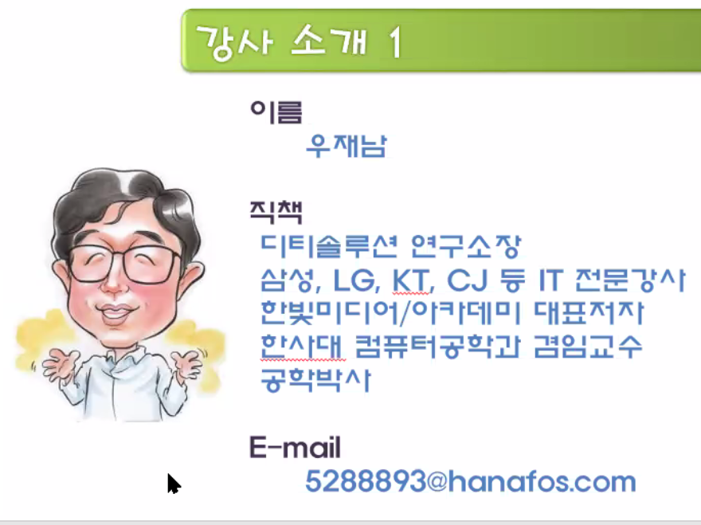

자료구조/알고리즘이 처음 ----> 완전하게 정리 ---> 향후에 시간을 절약

내가 잘할 수 있는 것을 표현

자료구조와 알고리즘의 관계 : 음식의 재료와 요리법

## 자료구조

- 선형 : 선형리스트 (카세트테이프), 연결리스트 (CD), 스택, 큐
- 비선형 : 트리, 그래프

## 알고리즘 

###  재귀호출, 정렬. 검색

## 코딩 잘 하는 법

암기를 활용 (좋은 표준 샘플 코드를 통째로 암기) ---> LISP

##  비전공

 : 정보처리기사(*) ---> 컴퓨터 관련학과 4학년까지 배운 내용중 핵심 과목

**취업(정보처리기사) --> 5년정도 경력 --> 정보관리기술자 자격 (기술계의 박사) --> 기술사 (업그레이드)**

## 전공

: 정보보안 / 전자계산기조직응용


## 최종 수업 정리 

자료구조 & 알고리즘 총정리 --> 전반적인 개념을 파악, 타인에게 알려주도록 정리

1. 선형: 선형 리스트, 연결 리스트, 스택,  원형큐(%size)
2. 비선형: 트리(이진 탐색 트리), 그래프 (연관배열)
3. 현업 실전 문제 : 2문제


--------------------------

# 01. 큐

## 큐의 기본

데이터 삽입 : enQueue
데이터 추출 : deQueue
데이터 머리 front
데이터 꼬리 rear

```python
```

# 02. 스택


# 03. 이진트리


# 04. 그래프

## 그래프의 종류

### 무방향 그래프 : 활용을 더 많이 한다.

- 간선에 방향성이 없는 그래프
- G1,G2의정점집합표현
- G1,G2의간선집합표현

### 방향 그래프

- 화살표로 간선 방향을 표기하고, 그래프의 정점 집합이 무방향 그래프와 같음

### 가중치 그래프

- 간선마다 가중치가 다르게 부여된 그래프
- 무방향 그래프와 방향그래프에 각각 가중치를 부여한 경우 예


## 깊이 우선 탐색의 작동

- 그래프의 모든 정점을 한 번씩 방문하는 것을 그래프 순회(Graph Traversal)라고 함 
- 그래프 순회 방식은 깊이 우선 탐색, 너비 우선 탐색이 대표적


## 그래프의 인접 행렬 표현

- 그래프를 코드로 구현할 때는 인접 행렬을 사용
- 인접 행렬은 정방형으로 구성된 행렬로 정점이 4개인 그래프는 4×4로 표현