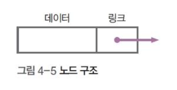
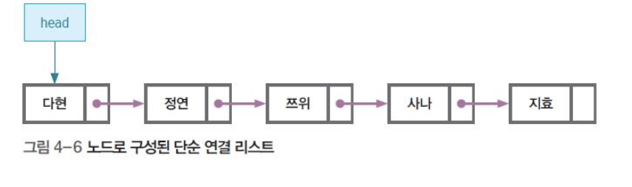

## 01. 자료구조와 알고리즘 소개

## 02. 선형리스트

### 생활 속 자료구조와 알고리즘

### 선형 리스트란? 

- 데이터를 일정한 순서로 나열한 자료구조
- 순차 리스트 라고도 함
- 선형 리스트는 입력 순서대로 저장하는 데이터에 적당
- 선형 리스트는 실제 물리적으로 옆에 붙어 있다.
- 컴퓨터는 메모리에 저장을 해놓는다.

### 선형 리스트의 원리

- 데이터 삽입
- 데이터 삭제

## 03. 단순 연결 리스트

### 단순 연결 리스트의 기본

#### 데이터를 삽입/ 삭제할 때

- 선형 리스트는 많은 작업이 필요(오버헤드 발생)
- 단순 연결 리스트는 해당 노드의 앞뒤 링크만 수정하면 되므로 오버헤드가 거의 발생하지 않음

### 단순 연결 리스트의 원리

#### 노드 구조

- 단순 연결 리스트는 다음 데이터를 가리키는 링크가 더 필요

- 노드는 데이터와 링크로 구성된 항목

  

  

#### 노드 (데이터) 삽입

#### 노드(데이터) 삭제

## 노드 생성과 연결

### 노드 생성과 연결

- 노드 생성

## 배열에 저장된 데이터 입력 과정

### 데이터 입력 과정

