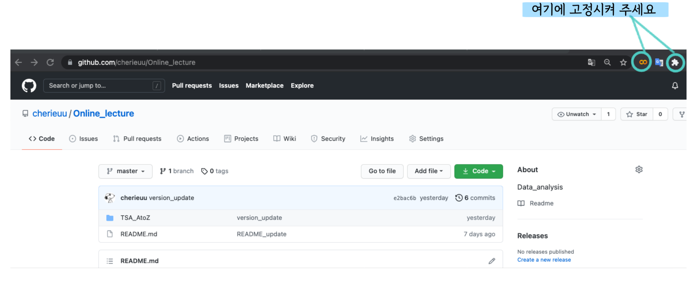
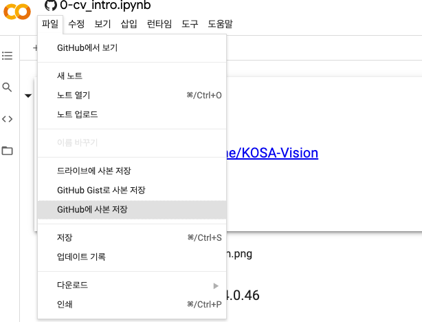
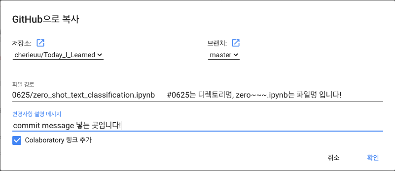

# 😎 Colab & GitHub 연결

```markdown
여러분 제가 colab 과 git hub를 연결하는 꿀팁을 가지고 왔습니다.

그건 바로 크롬의 확장 프로그램을 이용하는 것인데요...! 

저는 처음 겪고 얼마나 신기하던지..✨ 파일관리가 그나마 쉬워질 것 같다는 생각에 ... 
과장 조금 보태서 눈물이 날 뻔했습니다. 🥺
```


## ✨방법✨

1. [colab 확장](https://chrome.google.com/webstore/detail/open-in-colab/iogfkhleblhcpcekbiedikdehleodpjo?hl=ko&)에 들어가셔서 확장 설치를 해줍니다! *링크 연동 되어있어요!

   

2. 크롬 검색창 오른쪽 사이드에 저렇게 고정시켜주세요!
   

   

   

3. 고정이 완료 되었으면, **.ipynb 파일이 있는 Git Hub**로 들어가주세요! </br>
   ex) 저의 온라인 강의 자료를 예시로 공유합니다. ㅎㅎ 여기로 들어가주세요!   ‼️CLICK CLICK‼️👉🏻 [Lecture1](https://github.com/cherieuu/Online_lecture/blob/master/TSA_AtoZ/Lecture1_DataAnalysis_DataScience_KK.ipynb)

   

4. **.ipynb 파일이 있는 Git Hub링크**에 들어간 후, 아까 고정했었던 **colab 확장 아이콘을 클릭**해주세요!!


    

   

5. ✨짜잔✨이렇게 바로 **colab**!! 연결이 되었습니다!!

   
   

6. 그럼 이제 각자 막 실행도 하고, 코드 변경도 하고.. 이것저것 하다가 내 깃허브에 `push`를 하고 싶으면 `file`탭을 눌러서 `GitHub에 사본저장` 을 눌러줍니다.


    

   

7. 그럼 이런 창이 뜨는데 여기서 바로 본인의 깃허브 repo에 저장이 가능합니다!</br>
    `저장소`는 repo 지정하는 것이고, `브랜치` 설정도 있고, `파일경로`에서 디렉토리, 파일명 등을 지정하여 </br>
   저장할 수 있습니다. <br/>
   폴더명/ 파일명.ipynb 이런식으로 하면 repo 안 디렉토리에 파일을 넣을 수 있습니다.


   

   

   ### 저는 매번 zip 파일 받고 코랩에 연결하고 하느라 너무 번거로웠는데 

   ### 너무 편해서 깜짝 놀랐습니다! 이제 이런식으로 활용해보려구요..!!

   ### (저만 지금 알았다면 죄송합니다 ㅎㅎ 🧐)

#### 